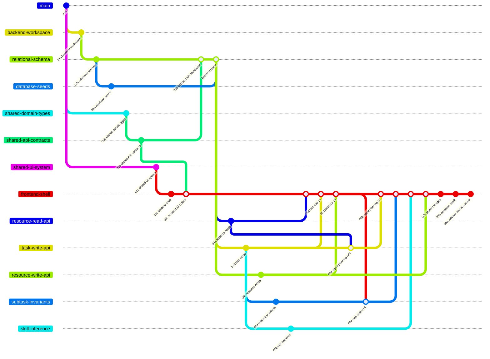

# OpenSpec Change Start Order

Each numbered file is one small OpenSpec change. Start with wave `01`, then move to a later number only after the exact dependencies named in that file are complete. Files sharing a number and using different letter suffixes are intended to run in parallel when their dependencies are ready.



## Start here

You can begin these three changes immediately and in parallel:

1. [01a — Add Backend Workspace](./01a-add-backend-workspace.md)
2. [01b — Add Shared Domain Types](./01b-add-shared-domain-types.md)
3. [01c — Add Shared UI System](./01c-add-shared-ui-system.md)

If you are implementing sequentially, use filename order: `01a`, `01b`, `01c`, then follow the wave table. Within one wave, letter order is only a convenient reading order, not an additional dependency.

## Dependency waves

| Wave | Changes                                                                                                                                                                                                                                                                      | Starts after                    |
| ---- | ---------------------------------------------------------------------------------------------------------------------------------------------------------------------------------------------------------------------------------------------------------------------------- | ------------------------------- |
| `01` | [Backend workspace](./01a-add-backend-workspace.md), [shared domain types](./01b-add-shared-domain-types.md), [shared UI system](./01c-add-shared-ui-system.md)                                                                                                              | Root                            |
| `02` | [Relational schema](./02a-add-relational-task-schema.md), [shared API contracts](./02b-add-shared-api-contracts.md), [frontend shell](./02c-add-frontend-application-shell.md)                                                                                               | Corresponding `01` foundation   |
| `03` | [Database seeds](./03a-add-database-seeds.md), [backend API foundation](./03b-add-backend-api-foundation.md), [frontend API client](./03c-add-frontend-api-client.md)                                                                                                        | Dependencies named in each file |
| `04` | [Resource reads](./04a-add-resource-read-api.md), [task writes](./04b-add-task-write-api.md), [resource writes](./04c-add-resource-write-api.md)                                                                                                                             | Backend API foundation + seeds  |
| `05` | [Subtask invariants](./05a-add-subtask-completion-invariants.md), [skill inference](./05b-add-task-skill-inference.md), [task tree UI](./05c-add-task-tree-ui.md), [resource UI](./05d-add-resource-management-ui.md), [agent planning API](./05e-add-agent-planning-api.md) | Required `03`/`04` slices       |
| `06` | [Task status UI](./06a-add-task-status-ui.md), [agent planning UI](./06b-add-agent-planning-ui.md)                                                                                                                                                                           | Matching backend + task tree UI |
| `07` | [Pruned images](./07a-add-pruned-container-images.md), then [Compose stack](./07b-add-compose-stack.md)                                                                                                                                                                      | Product features complete       |
| `08` | [Validate and document delivery](./08a-validate-and-document-delivery.md)                                                                                                                                                                                                    | Complete stack                  |

## OpenSpec workflow

After removing the numeric wave prefix (`01a-`, `02b-`, and so on), the rest
of each filename equals the OpenSpec change name shown in the file. For example:

```bash
openspec show add-backend-workspace
```

After implementation and validation, archive changes in dependency order. Parallel siblings may be archived in any order after their shared prerequisites.
